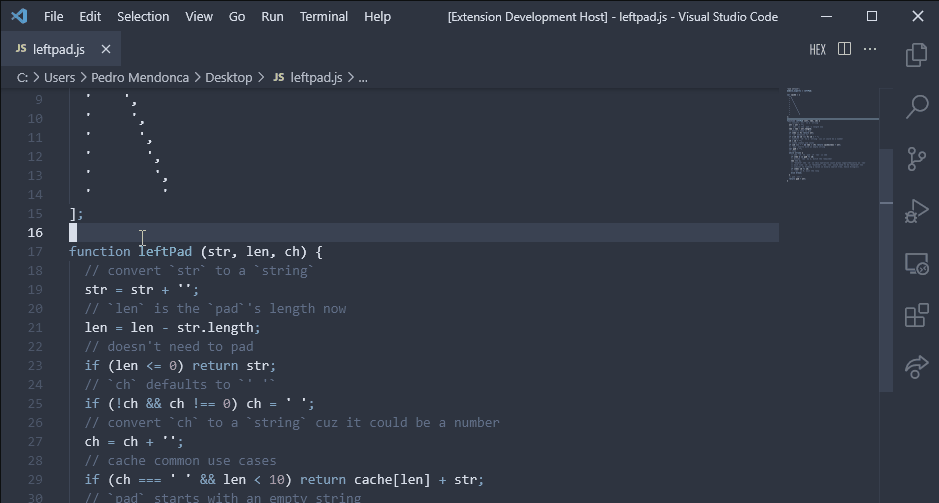

# Jester

Jester is a VsCode extension designed to solve a very specific problem.

Have you ever been stuck on a bug at 6pm on a friday and said, that is monday me's problem!. Well Jester lets you quickly drop a Joke on your code for future me.

Have you ever written some bad code and were worried it wouldn't pass a code review? Drop a jester joke as a distraction to your messy code.

## Features

- Drop a comment joke anywhere.
    - Simply use the `Joke me` command to add a joke comment to your code

## Instalation

## Release Notes

For release notes check our [Changelog](CHANGELOG.md)

## How to contribute

Just make a PR or an Issue

**Enjoy!**
